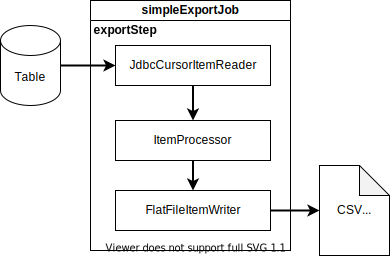
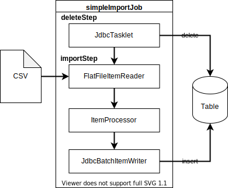
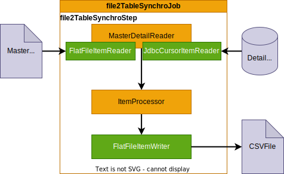
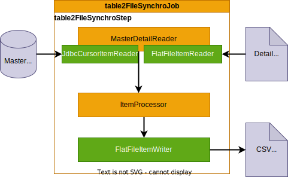
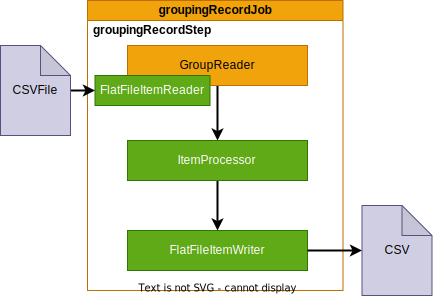
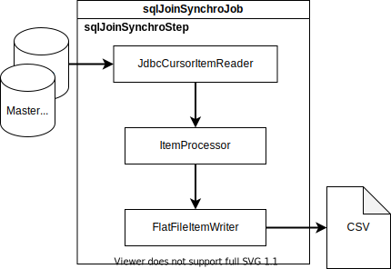
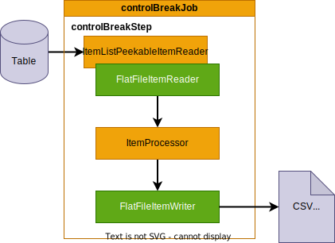
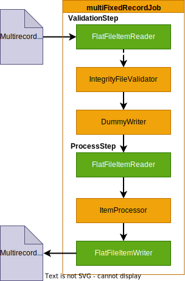
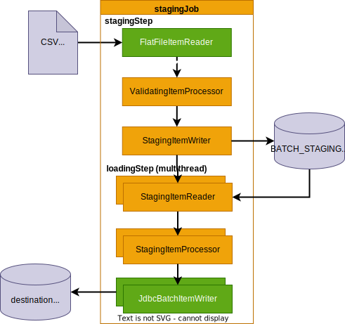

# SpringBatch patterns

This repository is for trainning purpose. It show a full Springboot SpringBatch integration using modular configuration to avoid bean name/type conflicts.

Each job can be launch independently using **-Dspring.batch.job.names={jobname}** parameter. (see Eclipse launch configurations for other parameters)

It use **postgreSQL** database and **H2** for tests.

## Introduction

## Pattern 1 : Export Job

[SimpleExportJobConfig.java](https://github.com/desprez/springbatch-patterns/blob/master/src/main/java/fr/training/springbatch/exportjob/SimpleExportJobConfig.java)

This is the simplest job configuration (no really inovation here).
One step use the reader / processor / writer pattern to read a database table and write the content "as is" to a comma separated flat file.

**Specificity :** the **incrementalFilename** method get an unique filename resource according to a file name and a job unique run identifier (Must be used in conjunction with RunIdIncrementer).

## Pattern 2 : Import Job

[SimpleImportJobConfig.java](https://github.com/desprez/springbatch-patterns/blob/master/src/main/java/fr/training/springbatch/importjob/SimpleImportJobConfig.java)

Another job configuration that read a file to fill a table like an ETL (extract, transform and load).

The 1st Step (deleteStep) erase table records before the "load" Step. It use a **JdbcTasklet** to execute SQL command against the table.

## Pattern 3 : Synchronize 2 files (master/detail)

[File2FileSynchroJobConfig.java](https://github.com/desprez/springbatch-patterns/blob/master/src/main/java/fr/training/springbatch/synchrojob/File2FileSynchroJobConfig.java)

This configuration may not be very usual but it can be interesting when you want to aggregate 2 files that share the same key. Typically with a master file and a detail file (ie Orders and OrderLines).

This job configuation use a **MasterDetailReader** Class to drive a master accumulator (CustomerAccumulator) and a Detail accumulator (TransactionAccumulator). These classes inherit from **ItemAccumulator**, a generic class used to define the shared key between master and detail objects.

In this way, complete object should be filled entierely by the reader.

**MasterDetailReader** uses the delegator pattern to delegate the reading to a specialized reader (flatfile, jdbc, ...or whatever)

## Pattern 4 : Synchronize a file with a table

[File2TableSynchroJobConfig.java](https://github.com/desprez/springbatch-patterns/blob/master/src/main/java/fr/training/springbatch/synchrojob/File2TableSynchroJobConfig.java)

This pattern is a little bit different from the previous one but works the same way. This time the reader, the master csv file is synchronized with a table which contains the detail datas.

The **MasterDetailReader**, **TransactionAccumulator** and **CustomerAccumulator** classes are generic enough to be reused.

## Pattern 5 : Synchronize a table with a with a file

[Table2FileSynchroJobConfig.java](https://github.com/desprez/springbatch-patterns/blob/master/src/main/java/fr/training/springbatch/synchrojob/Table2FileSynchroJobConfig.java)

Another variation of the previous patterns. This time, the "Master" data comes from a table in the database and the "Details" data comes from a csv file.

## Pattern 6 : Grouping file records

[GroupingRecordsJobConfig.java](https://github.com/desprez/springbatch-patterns/blob/master/src/main/java/fr/training/springbatch/synchrojob/GroupingRecordsJobConfig.java)

## Pattern 7 : Grouping tables records (with SQL)

[SQLJoinSynchroJobConfig.java](https://github.com/desprez/springbatch-patterns/blob/master/src/main/java/fr/training/springbatch/synchrojob/SQLJoinSynchroJobConfig.java)

With this pattern, a grouping SQL query sumarize the transactions to compute the customer balance.

No processor usage.

## Pattern 8 : Control Break Job

[ControlBreakJobConfig.java](https://github.com/desprez/springbatch-patterns/blob/master/src/main/java/fr/training/springbatch/controlbreakjob/ControlBreakJobConfig.java)

Another way to return Transactions list from the reader (similar to groupingRecordJob) but use the **ItemListPeekableItemReader** that use a _BreakKeyStrategy_ to groups records that have same "group" key (ie the customer number).

## Pattern 9 : Multi records Fixed Job

[MultiFixedRecordJobConfig.java](https://github.com/desprez/springbatch-patterns/blob/master/src/main/java/fr/training/springbatch/job/fixedjob/MultiFixedRecordJobConfig.java)

This pattern show the way to read and write a multirecords fixed lenght file (like COBOL files). This job use a **PatternMatchingCompositeLineMapper** to map line with a record Type (ie: 00 for header, 01 for details and 99 for footer).

## Pattern 10 : Staging Job

[StagingJobConfig.java](https://github.com/desprez/springbatch-patterns/blob/master/src/main/java/fr/training/springbatch/job/stagingjob/StagingJobConfig.java)

This pattern is a java configuration adaptation of the original [Spring-batch parallelJob.xml](https://github.com/spring-projects/spring-batch/blob/c4b001b732c8a4127e6a2a99e2fd00fff510f629/spring-batch-samples/src/main/resources/jobs/parallelJob.xml) config

_The job reads data from the same file as the **Import sample**, but instead of writing it out directly it goes through a staging table, and the staging table is read in a multi-threaded step._

This job use :
- ItemCountListener for Logging the count of items processed at a specified interval.
- 
