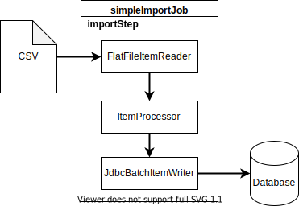
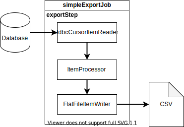

# SpringBatch patterns

##

## Pattern 1 : Import Job

## Pattern 2 : Export Job

## Pattern 3 : Staging Job

## Pattern 4 : Synchronize a file with a table

## Pattern 5 : Synchronize a table with a with a file

## Pattern 6 : Synchronize 2 tables

## Pattern 7 : Grouping file records

## Pattern 8 : Grouping tables records (with SQL)