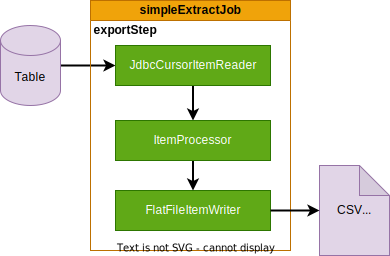
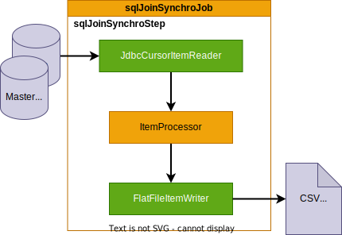

# SpringBatch patterns

This repository is for trainning purpose. It show a full Springboot SpringBatch integration using modular configuration to avoid bean name/type conflicts.

Each job can be launch independently using **-Dspring.batch.job.names={jobname}** parameter. (see Eclipse launch configurations for other parameters)

It use **postgreSQL** database and **H2** for tests.

## Introduction

## Pattern 1 : Export Job

[SimpleExtractJobConfig.java](https://github.com/desprez/springbatch-patterns/blob/master/src/main/java/fr/training/springbatch/job/extract/SimpleExtractJobConfig.java)

This is the simplest job configuration (no really inovation here).
One step use the reader / processor / writer pattern to read a database table and write the content "as is" to a comma separated flat file.

**Specificity :** the **incrementalFilename** method get an unique filename resource according to a file name and a job unique run identifier (Must be used in conjunction with RunIdIncrementer).

## Pattern 2 : Import Job

[SimpleLoadJobConfig.java](https://github.com/desprez/springbatch-patterns/blob/master/src/main/java/fr/training/springbatch/job/load/SimpleLoadJobConfig.java)

Another job configuration that read a file to fill a table like an ETL (extract, transform and load).

The 1st Step (deleteStep) erase table records before the "load" Step. It use a **JdbcTasklet** (from Pivotal) to execute SQL command against the table.

## Pattern 3 : Synchronize 2 files (master/detail)

[File2FileSynchroJobConfig.java](https://github.com/desprez/springbatch-patterns/blob/master/src/main/java/fr/training/springbatch/job/synchro/File2FileSynchroJobConfig.java)

This configuration may not be very usual but it can be interesting when you want to aggregate 2 files that share the same key. Typically with a master file and a detail file (ie Orders and OrderLines).

This job configuation use a **MasterDetailReader** Class to drive a master accumulator (CustomerAccumulator) and a Detail accumulator (TransactionAccumulator). These classes inherit from **ItemAccumulator**, a generic class used to define the shared key between master and detail objects.

In this way, complete object should be filled entierely by the reader.

**MasterDetailReader** uses the delegator pattern to delegate the reading to a specialized reader (flatfile, jdbc, ...or whatever)

## Pattern 4 : Synchronize a file with a table

[File2TableSynchroJobConfig.java](https://github.com/desprez/springbatch-patterns/blob/master/src/main/java/fr/training/springbatch/job/synchro/File2TableSynchroJobConfig.java)

This pattern is a little bit different from the previous one but works the same way. This time the reader, the master csv file is synchronized with a table which contains the detail datas.

The **MasterDetailReader**, **TransactionAccumulator** and **CustomerAccumulator** classes are generic enough to be reused.

## Pattern 5 : Synchronize a table with a with a file

[Table2FileSynchroJobConfig.java](https://github.com/desprez/springbatch-patterns/blob/master/src/main/java/fr/training/springbatch/job/Table2FileSynchroJobConfig.java)

Another variation of the previous patterns. This time, the "Master" data comes from a table in the database and the "Details" data comes from a csv file.

## Pattern 6 : Grouping file records

[GroupingRecordsJobConfig.java](https://github.com/desprez/springbatch-patterns/blob/master/src/main/java/fr/training/springbatch/job/GroupingRecordsJobConfig.java)

This pattern reads items packets that share the same key and returns lists that can be summed or whatever... (this is a "read  many and write one" example)

## Pattern 7 : Grouping tables records (with SQL)

[SQLJoinSynchroJobConfig.java](https://github.com/desprez/springbatch-patterns/blob/master/src/main/java/fr/training/springbatch/job/synchro/SQLJoinSynchroJobConfig.java)

With this pattern, a grouping SQL query sumarize the transactions to compute the customer balance.

No processor usage.

## Pattern 8 : Control Break Job

[ControlBreakJobConfig.java](https://github.com/desprez/springbatch-patterns/blob/master/src/main/java/fr/training/springbatch/job/controlbreak/ControlBreakJobConfig.java)

Another way to return Transactions list from the reader (similar to groupingRecordJob) but use the **ItemListPeekableItemReader** that use a __Strategy pattern__ (see [BreakKeyStrategy.java](https://github.com/desprez/springbatch-patterns/blob/master/src/main/java/fr/training/springbatch/controlbreak/BreakKeyStrategy.java)) to groups records that have same "group" key (ie the customer number) in a easy configurable way (to sum records in this example).

## Pattern 9 : Multi records Fixed Job

[MultiFixedRecordJobConfig.java](https://github.com/desprez/springbatch-patterns/blob/master/src/main/java/fr/training/springbatch/job/fixedsize/MultiFixedRecordJobConfig.java)

This pattern show the way to read and write a multirecords fixed lenght file (like COBOL files). This job use a **PatternMatchingCompositeLineMapper** to map line with a record Type (ie: 00 for header, 01 for details and 99 for footer).

## Pattern 10 : Staging Job

[StagingJobConfig.java](https://github.com/desprez/springbatch-patterns/blob/master/src/main/java/fr/training/springbatch/job/staging/StagingJobConfig.java)

This pattern is a java configuration adaptation of the original [Spring-batch parallelJob.xml](https://github.com/spring-projects/spring-batch/blob/c4b001b732c8a4127e6a2a99e2fd00fff510f629/spring-batch-samples/src/main/resources/jobs/parallelJob.xml) config

_The job reads data from the same file as the **Import sample**, but instead of writing it out directly it goes through a staging table, and the staging table is read in a multi-threaded step._

This job use :
- ItemCountListener for Logging the count of items processed at a specified interval.
- StagingItemWriter that fill BATCH_STAGING table with serialized items.
- StagingItemProcessor that marks the input row as 'processed'.
- StagingItemReader that read the BATCH_STAGING table for record not processed.

## Pattern 11 : Daily Job

[DailyJobConfig.java](https://github.com/desprez/springbatch-patterns/blob/master/src/main/java/fr/training/springbatch/job/daily/DailyJobConfig.java)

This pattern show how to configure a job that run once per day and prevent to not be launch twice.

## Pattern 12 : Multi files Load Job

[MultiFilesLoadJobConfig.java](https://github.com/desprez/springbatch-patterns/blob/master/src/main/java/fr/training/springbatch/job/load/MultiFilesLoadJobConfig.java)

This Job load Transaction csv files present in a directory sequentialy insert each read line in a Transaction Table. It use **MultiResourceItemReader** class to loop over all files found and delegate the file loading the to a reader.

## Pattern 13 : Extract with Process Indicator Job

[ExtractProcessIndicatorJobConfig.java](https://github.com/desprez/springbatch-patterns/blob/master/src/main/java/fr/training/springbatch/job/extract/processindicator/ExtractProcessIndicatorJobConfig.java)

This pattern use a process indicator to flag processed records (unlike the staging job Processed Column is present in the table)

## Pattern 14 : File Partition Job

[FilePartitionJobConfig.java](https://github.com/desprez/springbatch-patterns/blob/master/src/main/java/fr/training/springbatch/job/partition/file/FilePartitionJobConfig.java)

This pattern use **MultiResourcePartitioner** to create partitions upon files presents in a folder.

## Pattern 15 : Jdbc partition Job

[JDBCPartitionJobConfig.java](https://github.com/desprez/springbatch-patterns/blob/master/src/main/java/fr/training/springbatch/job/partition/jdbc/JDBCPartitionJobConfig.java)

## Pattern 16 : Compute Delta Job

[ComputeDeltaJobConfig.java](https://github.com/desprez/springbatch-patterns/blob/master/src/main/java/fr/training/springbatch/job/computedelta/ComputeDeltaJobConfig.java)

Imagine that you receive a different file every day from your partner with all the data.

And that you have to update your system with the added or deleted data, this is exactly what this job does, it compute the delta between the file recevied at day N-1 with the file received at day N (usually used in companies that use files to transmit data).

## Some usefull tools can be used in patterns

### Tasklets
All the classes below _have a JUnit test_ that shows how they work.

- [RemoveSpringBatchHistoryTasklet.java](https://github.com/desprez/springbatch-patterns/blob/master/src/main/java/fr/training/springbatch/tools/tasklet/RemoveSpringBatchHistoryTasklet.java) updated version of the [Antoine Rey's original](https://github.com/arey/spring-batch-toolkit/blob/master/src/main/java/com/javaetmoi/core/batch/tasklet/RemoveSpringBatchHistoryTasklet.java)

- [AnalyzePGTasklet.java](https://github.com/desprez/springbatch-patterns/blob/master/src/main/java/fr/training/springbatch/tools/tasklet/AnalyzePGTasklet.java) to force **PostgreSQL** to _Analyse_ the given tables after heavy loading.

- [GatherStatisticTasklet.java](https://github.com/desprez/springbatch-patterns/blob/master/src/main/java/fr/training/springbatch/tools/tasklet/GatherStatisticTasklet.java) to force **Oracle** to _Gather Statistics_ for the given tables after heavy loading.

- [CompressTasklet.java](https://github.com/desprez/springbatch-patterns/blob/master/src/main/java/fr/training/springbatch/tools/tasklet/CompressTasklet.java) to **zip file** in a Step (before send it for example)

- [DecompressTasklet.java](https://github.com/desprez/springbatch-patterns/blob/master/src/main/java/fr/training/springbatch/tools/tasklet/DecompressTasklet.java) to **unzip file** in a Step (after received it for example)

- [RestServiceTasklet.java](https://github.com/desprez/springbatch-patterns/blob/master/src/main/java/fr/training/springbatch/tools/tasklet/RestServiceTasklet.java) usefull if you have to **call Rest Service** in jobs.

- [CopyFileTasklet.java](https://github.com/desprez/springbatch-patterns/blob/master/src/main/java/fr/training/springbatch/tools/tasklet/CopyFileTasklet.java) to copy file in another folder.

- [MoveFileTasklet.java](https://github.com/desprez/springbatch-patterns/blob/master/src/main/java/fr/training/springbatch/tools/tasklet/MoveFileTasklet.java) to move file in another folder.

- [MoveFilesTasklet.java](https://github.com/desprez/springbatch-patterns/blob/master/src/main/java/fr/training/springbatch/tools/tasklet/MoveFilesTasklet.java) to move files in another folder.

### Chaos testing Tasklets

These tasklet can be used to simulate fails during batch execution.

- [BipolarTasklet.java](https://github.com/desprez/springbatch-patterns/blob/master/src/main/java/fr/training/springbatch/tools/chaos/tasklet/BipolarTasklet.java) that throw exception on odd runs.

- [RandomFailTasket.java](https://github.com/desprez/springbatch-patterns/blob/master/src/main/java/fr/training/springbatch/tools/chaos/tasklet/RandomFailTasket.java) used to mimimic unstable process.

- [SlowPGQueryTasklet.java](https://github.com/desprez/springbatch-patterns/blob/master/src/main/java/fr/training/springbatch/tools/chaos/tasklet/SlowPGQueryTasklet.java) used to mimimic slow PosgreSQL queries.

- [WaitingTasklet.java](https://github.com/desprez/springbatch-patterns/blob/master/src/main/java/fr/training/springbatch/tools/chaos/tasklet/WaitingTasklet.java) used to mimimic long duration process. Display countdown.

### Listeners

TO DO

### JobParametersValidators

TO DO

### Readers

TO DO

### Writers

TO DO

### Processors

TO DO

