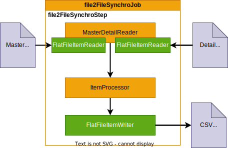

# SpringBatch patterns

This repository is for trainning purpose. It show a full Springboot SpringBatch integration using modular configuration to avoid bean name/type conflicts.

Each job can be launch independently using **-Dspring.batch.job.names={jobname}** parameter. (see Eclipse launch configurations for other parameters)

It use **postgreSQL** database and **H2** for tests.

## Introduction

## Pattern 1 : Export Job

[SimpleExportJobConfig.java](https://github.com/desprez/springbatch-patterns/blob/master/src/main/java/fr/training/springbatch/exportjob/SimpleExportJobConfig.java)

This is the simplest job configuration (no really inovation here).
One step use the reader / processor / writer pattern to read a database table and write the content "as is" to a comma separated flat file.

**Specificity :** the **incrementalFilename** method get an unique filename resource according to a file name and a job unique run identifier (Must be used in conjunction with RunIdIncrementer).

## Pattern 2 : Import Job

[SimpleImportJobConfig.java](https://github.com/desprez/springbatch-patterns/blob/master/src/main/java/fr/training/springbatch/importjob/SimpleImportJobConfig.java)

Another job configuration that read a file to fill a table like an ETL (extract, transform and load).

The 1st Step (deleteStep) erase table records before the "load" Step. It use a **JdbcTasklet** to execute SQL command against the table.

## Pattern 3 : Synchronize 2 files (master/detail)

[File2FileSynchroJobConfig.java](https://github.com/desprez/springbatch-patterns/blob/master/src/main/java/fr/training/springbatch/synchrojob/File2FileSynchroJobConfig.java)

## Pattern 4 : Synchronize a file with a table

[File2TableSynchroJobConfig.java](https://github.com/desprez/springbatch-patterns/blob/master/src/main/java/fr/training/springbatch/synchrojob/File2TableSynchroJobConfig.java)

## Pattern 5 : Synchronize a table with a with a file

[Table2FileSynchroJobConfig.java](https://github.com/desprez/springbatch-patterns/blob/master/src/main/java/fr/training/springbatch/synchrojob/Table2FileSynchroJobConfig.java)

## Pattern 6 : Grouping file records

[GroupingRecordsJobConfig.java](https://github.com/desprez/springbatch-patterns/blob/master/src/main/java/fr/training/springbatch/synchrojob/GroupingRecordsJobConfig.java)

## Pattern 7 : Grouping tables records (with SQL)

[SQLJoinSynchroJobConfig.java](https://github.com/desprez/springbatch-patterns/blob/master/src/main/java/fr/training/springbatch/synchrojob/SQLJoinSynchroJobConfig.java)

## Pattern 8 : Staging Job
